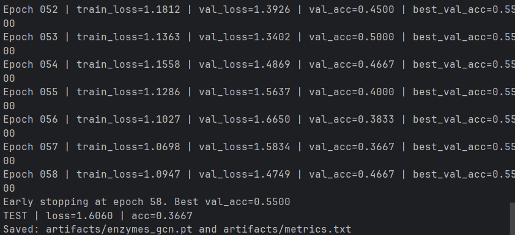
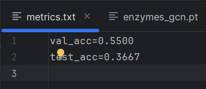

ENZYMES GCN — How to run

What this is:
- I’m training a Graph Convolutional Network (GCN) with PyTorch Geometric to do graph-level classification on the ENZYMES dataset (6 classes). Each graph = a protein.

Folder setup I’m using:
- main.py            -> training + eval
- models.py          -> the GCN model (GCNConv + pooling + MLP)
- utils.py           -> set_seed, small helpers
- requirements.txt   -> packages
- data/ENZYMES/      -> I put the raw ENZYMES_*.txt files here
- artifacts/         -> gets created after training (model + metrics)

1) Create venv + install
------------------------
Windows (PowerShell):
  python -m venv .venv
  .venv\Scripts\activate
  pip install -r requirements.txt

(macOS/Linux would be: source .venv/bin/activate)

If pip complains about torch-scatter / torch-sparse / etc, I install the right PyG wheels for my Torch/CPU/CUDA (from the PyG docs), then re-run the install.

2) Put the dataset in place
---------------------------
I downloaded ENZYMES from the TUDataset site and put the raw files directly in:
  data/ENZYMES/
    ENZYMES_A.txt
    ENZYMES_graph_indicator.txt
    ENZYMES_graph_labels.txt
    ENZYMES_node_labels.txt
    ENZYMES_node_attributes.txt (if present)
    ENZYMES_edge_labels.txt     (if present)

No manual preprocessing needed. The code copies these into the path PyG expects and processes them. If node features are missing, the script auto-creates them and then normalizes.

3) Run it
---------
Smoke test (1 epoch, just to see it works):
  python main.py --root "data/ENZYMES" --epochs 1

Full training:
  python main.py --root "data/ENZYMES" --epochs 100

Useful flags I sometimes tweak:
  --batch_size 32
  --hidden 128   --layers 3   --dropout 0.5
  --lr 1e-3      --weight_decay 5e-4
  --seed 42

4) What gets saved
------------------
After training, I get:
  artifacts/enzymes_gcn.pt   (trained weights)
  artifacts/metrics.txt      (best val_acc + final test_acc)

Example from my last run:
  val_acc=0.5500
  test_acc=0.3667

5) What the model actually does (super short)
---------------------------------------------
- Stacks GCNConv layers to do message passing over the graph.
- Pools node embeddings to one graph embedding (graph-level).
- MLP head predicts one of 6 enzyme classes.

6) If something breaks
----------------------
- “TypeError: 'NoneType' object is not callable”:
    Don’t call dataset.transform(...). The code sets:
    dataset.transform = NormalizeFeatures()

- num_features == 0:
    My code builds features automatically (one-hot from labels or constant ones) and then normalizes.

- PyG install issues:
    I grab the proper wheels for my Torch + CPU/CUDA, then:
    pip install -r requirements.txt
